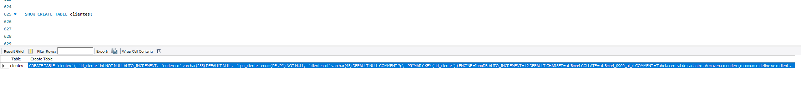

# Projeto Logístico: E-commerce Refinado (Lógico/SQL)
**Analista:** Paulo Roberto  
**Base do Projeto:** Bootcamp Klabin - Excel e Power BI Dashboards  
**Tecnologia:** MySQL Workbench

## Desafio de Projeto: E-commerce Refinado (Lógico/SQL)

### Descrição do Projeto
Este projeto consiste na replicação e refinamento do modelo lógico de e-commerce. Foram aplicadas definições rigorosas de Chaves Primárias (PK), Estrangeiras (FK) e Constraints para garantir a integridade referencial. O modelo atende aos refinamentos propostos no módulo de modelagem conceitual, focando na especialização de clientes, flexibilidade de pagamentos e rastreamento logístico.

### Modificações Estruturais
Para os novos recursos funcionarem, as seguintes alterações foram realizadas:

* **Tabela clientes:** Removidos campos específicos (CPF, Nomes) para a tabela clientes_pf, tornando-a uma tabela base de endereçamento e tipo.
* **Tabela pedidos:** Adicionada a coluna id_pedido_pagamento para vincular a transação exata ao fechamento da venda.
* **Novas Tabelas:** Inclusão de clientes_pf, clientes_pj, pagamentos e entregas para suporte às novas regras de negócio.

### Script SQL (Criação e Povoamento)
O script contempla a criação de todas as 14 tabelas (incluindo as de relacionamento M:N) e a persistência de dados para testes, com registros distribuídos entre todos os perfis (clientes, fornecedores, vendedores e produtos).

---

## Desafio

### A) As queries foram desenvolvidas utilizando os requisitos técnicos solicitados:
1- Recuperações simples com SELECT Statement  
2- Filtros com WHERE Statement  
3- Crie expressões para gerar atributos derivados  
4- Defina ordenações dos dados com ORDER BY  
5- Condições de filtros aos grupos – HAVING Statement  
6- Crie junções entre tabelas para fornecer uma perspectiva mais complexa dos dados

### A) Queries SQL com as cláusulas do Desafio
* **Relatório de Clientes PF e seus Gastos:** Quem são nossos clientes físicos, quanto eles pagaram de frete total e qual seria o valor do frete com um acréscimo de 10% para seguro?
* **Análise de Compras por Tipo de Cliente:** Qual a média de frete paga por tipo de cliente (PF ou PJ), mas mostre apenas os tipos que gastaram mais de R$ 20,00 em média?
* **Rastreamento Logístico Detalhado:** Quais produtos estão em pedidos que foram 'Extraviados' ou estão 'Em trânsito'?
* **Gestão de Inventário e Fornecedores:** Quais produtos estão no estoque de São Paulo e quem é o seu fornecedor original?

### B) Queries de Perspectiva Complexa (Queries Adicionais)
* 1- Quais clientes (Nome/Razão Social) fizeram mais de 1 pedido?
* 2- Quais fornecedores atendem a categoria 'Eletrônico'?
* 3- Quais estados estão sofrendo com extravios e qual a média de frete que estamos cobrando nessas regiões críticas?
* 4- Qual o valor médio (Ticket Médio) de venda para cada tipo de pagamento (PIX, Cartão, etc.)?
* 5- Quais vendedores (sellers) têm mais variedade de produtos cadastrados?
* 6- Qual o risco de falta de produto por fornecedor e onde eles estão estocados?

---

## Refinamentos Implementados
Conforme as diretrizes do desafio, o esquema lógico foi expandido com os seguintes pontos:
* **A) Cliente PJ e PF** – Uma conta pode ser PJ ou PF, mas não pode ter as duas informações;
* **B) Pagamento** – Pode ter cadastrado mais de uma forma de pagamento;
* **C) Entrega** – Possui status e código de rastreio;

### Queries Básicas Sugeridas Pelo Objetivo do Desafio:
* **Quantos pedidos foram feitos por cada cliente?** (Usa INNER JOIN, LEFT JOIN, CASE, COUNT e GROUP BY)
* **Algum vendedor também é fornecedor?** (Usa INNER JOIN entre vendedores e fornecedores via CNPJ)
* **Relação de produtos, fornecedores e estoques.** (Usa Multi-Join e Atributo Derivado de Valor de Inventário)
* **Relação de nomes dos fornecedores e nomes dos produtos.** (Usa INNER JOIN e Atributo Derivado de Classificação de Mercado)

---

## Observação Final
Foi mantida a sincronia entre o modelo lógico e o físico. O esquema SQL apresentado reflete fielmente as entidades e relacionamentos modelados no diagrama EER. As Chaves Estrangeiras (FKs) e Constraints (como UNIQUE para CPF/CNPJ e ENUM para tipos de cliente) garantem que as regras de negócio definidas na modelagem conceitual sejam aplicadas rigorosamente no banco de dados real.

---

## Documentação Complementar
Para uma visão completa da arquitetura do projeto, acesse os arquivos abaixo:

* **[Script Principal (SQL)](./SCRIPTS/Projeto_1_e_commerce_refinado.sql)**
* **[Descrição do Projeto (TXT)](./DOCS/Projeto_1_e_commerce_refinado.txt)**
* **[Dicionário de Dados (Metadados)](./SCRIPTS/Metadados_e_Documentação_Projeto_1_e_commerce_refinado.sql)**
* **[Modelo Lógico (PDF)](./DOCS/Modelo_Logico_Ecommerce_Refinado_Projeto_1.pdf)**
* **[Arquivo de Projeto (MWB)](./MODELO/Modelo_Logico_Ecommerce_Refinado_Projeto_1.mwb)**

### Visualização de Metadados

